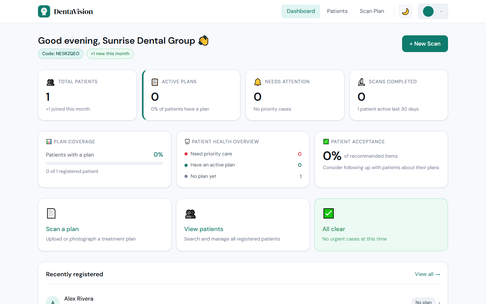
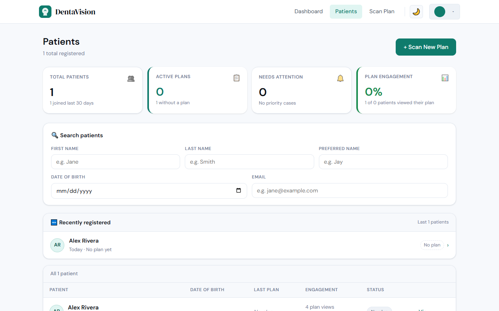
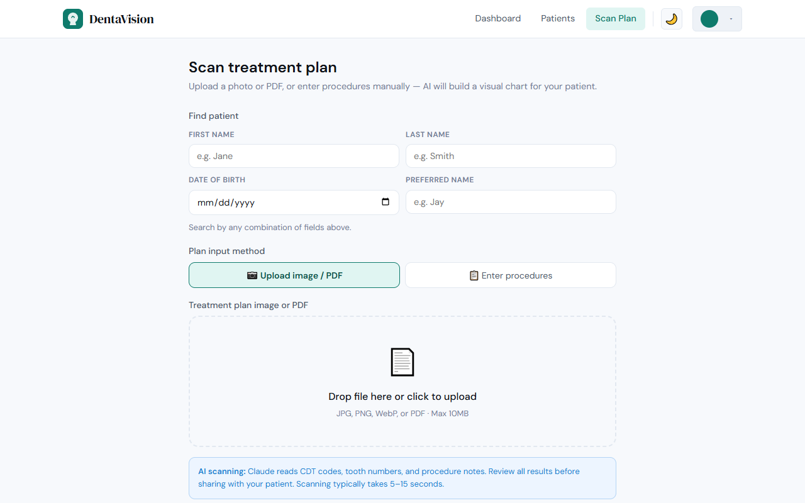
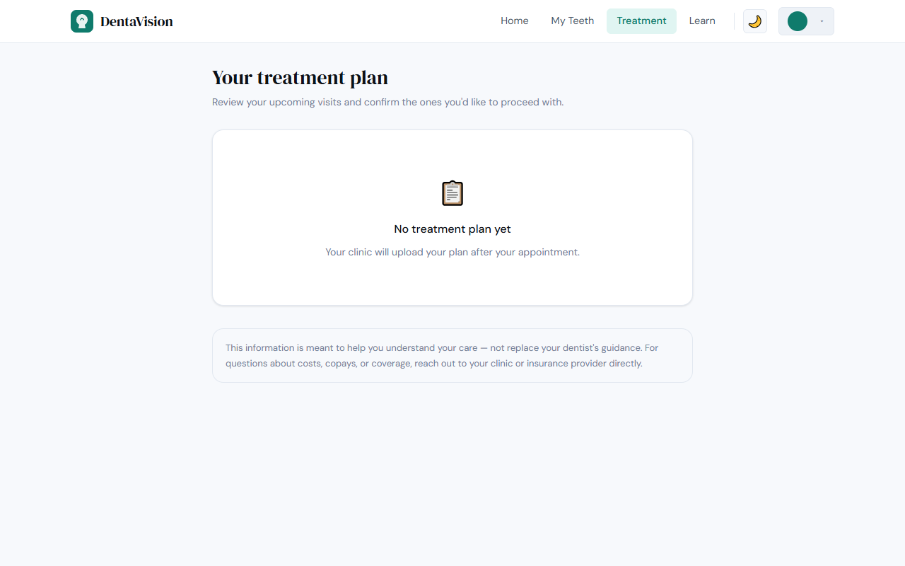
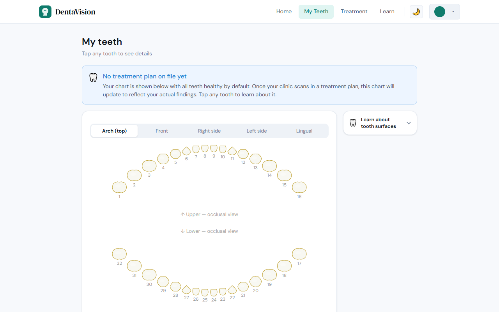
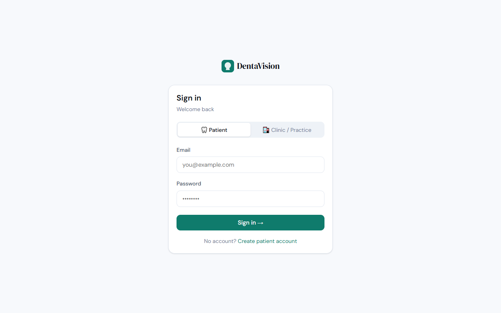

# DentaVision

[](https://github.com/Larmstrong1127/DentaVision/actions/workflows/ci.yml)

An **AI-powered dental treatment planning platform** that bridges the gap between clinic workflows and patient understanding. Clinics upload treatment plan images; Claude AI parses them into prioritized, visit-by-visit schedules that patients can review, confirm, and ask questions about. **This is a demo product — see the PHI notice below before using it with any real data.**

**Developer:** Landon Armstrong
**GitHub:** [Larmstrong1127](https://github.com/Larmstrong1127)
**Email:** Landon.Armstrong@stmartin.edu

> 🚀 **[Live Demo →](https://denta-vision.vercel.app)**

---

## ⚠️ Demo only — do not upload real patient information (PHI)

DentaVision is a demonstration and portfolio project. It is **not** cleared for
use with real patient data.

- Treatment plans are **Protected Health Information (PHI)** under HIPAA.
- A dental practice is a **covered entity** and may not disclose PHI to a
  vendor without a signed **Business Associate Agreement (BAA)**.
- **No BAA process exists for DentaVision**, and the codebase implements no
  HIPAA safeguard programme — no audit logging, no encryption-at-rest
  guarantees, no breach-notification process, no workforce training controls.
- Uploaded content is transmitted to the **Anthropic Claude API** for parsing.

Use the synthetic plans in [`samples/treatment-plans/`](samples/treatment-plans/)
— or your own clearly fictional data — for every demo, screenshot, and test.
Do not commit real treatment plans to this repository, even redacted.

If DentaVision is ever taken to production with real patients, that work must
start with a BAA, a risk analysis, and an actual safeguard implementation —
not with copy changes.

---

## Screenshots

### Clinic Portal

**Dashboard** — overview of patient activity, plan coverage, and engagement metrics



**Patients** — searchable patient list with analytics strip and recently registered panel



**Scan Plan** — upload a sample treatment plan image or PDF for AI parsing, or enter procedures manually (synthetic data only)



### Patient Portal

**My Treatment Plan** — visit-by-visit breakdown with confirmation checkboxes



**My Teeth Chart** — interactive SVG tooth chart with per-tooth finding details



### Authentication

**Sign In** — role-based login for patients and clinic staff



---

## Tech Stack

| Layer | Technology |
|---|---|
| Frontend | React 18, React Router v6 |
| Backend | Node.js, Express.js |
| Database | MongoDB Atlas (Mongoose) |
| AI | Claude AI (Anthropic API) — vision + conversational |
| Auth | JWT — separate clinic and patient roles |
| File Handling | Multer (image/PDF upload) |
| Deployment | Vercel (frontend) · Render (backend) |
| CI/CD | GitHub Actions — tests + build + deploy on every push |
| Testing | Jest + Supertest — 20 tests covering auth, JWT, and API routes |

---

## CI/CD Pipeline

Every push to `main` triggers a 3-stage GitHub Actions pipeline:

```
Push → [Server Tests (Jest)] + [Client Build] → Deploy to Production
                                                  ├── Backend → Render (via API)
                                                  └── Frontend → Vercel (auto-deploy)
```

- **Tests must pass** before any deployment runs
- **20 Jest + Supertest tests** cover clinic/patient auth, JWT validation, and API routes
- **Parallel CI jobs** keep feedback fast

---

## Features

### Clinic Side
- **AI Scan** — upload a photo or PDF of a printed treatment plan (synthetic samples only — see the PHI notice above); Claude extracts CDT codes, tooth numbers, surfaces, and procedure notes
- **Visit Scheduling** — AI auto-groups procedures into prioritized visit sequences (urgent → moderate → routine)
- **Dashboard** — patient count, plan coverage rate, engagement metrics, recently registered patients
- **Patient Search** — filter by name, DOB, or email with live debounced results
- **Flash Messages** — success/error feedback after every action

### Patient Side
- **Treatment Plan** — confirm visits, track status, read plain-language summaries
- **Interactive Tooth Chart** — SVG with 3 anatomical views; tap any tooth to see finding details
- **AI Chat Assistant** — ask questions about your specific procedures in plain English
- **Patient Education** — general dental health library powered by Claude

### Auth
- JWT authentication with separate clinic and patient roles
- Clinic registration code system — patients join a clinic with a short code
- Dark/light theme toggle persisted per user

---

## Architecture

```
dentavision/
├── client/                   # React SPA (deployed to Vercel)
│   ├── src/
│   │   ├── pages/
│   │   │   ├── clinic/       # Dashboard, Patients, Scan, PatientDetail, Billing
│   │   │   └── patient/      # Home, Treatment, Chart, Education
│   │   ├── components/
│   │   │   ├── chart/        # ToothChart + ToothDetail (SVG)
│   │   │   └── shared/       # NavBar, theme toggle
│   │   ├── context/          # AuthContext (JWT + role)
│   │   ├── hooks/            # useTheme
│   │   └── utils/            # Axios API client with auth interceptor
└── server/                   # Express API (deployed to Render)
    ├── routes/               # auth, clinics, patients, scan, education
    ├── models/               # Clinic, Patient, TreatmentPlan (Mongoose)
    ├── middleware/            # JWT auth middleware
    └── services/             # Claude AI integration, image processing
```

---

## AI Integration

Treatment plan parsing uses **Claude vision** — clinic staff upload an image or PDF of a printed treatment plan, and Claude extracts:

- CDT procedure codes and plain-language descriptions
- Tooth numbers and surfaces affected
- Recommended visit groupings and sequencing
- Priority classification (urgent / moderate / watch / healthy)
- Patient-friendly AI summary

The patient chat assistant uses **Claude conversational API** with the patient's full treatment plan injected as context, enabling accurate, personalized answers about their specific procedures.

---

## Running Locally

### Prerequisites
- Node.js 18+
- MongoDB Atlas URI (free tier works)
- Anthropic API key

### Setup

```bash
# Clone the repo
git clone https://github.com/Larmstrong1127/DentaVision.git
cd DentaVision

# Server
cd server
cp .env.example .env
# Edit .env: fill in MONGODB_URI, JWT_SECRET, ANTHROPIC_API_KEY
npm install
npm start          # API runs on http://localhost:4000

# Client (new terminal)
cd client
npm install
npm start          # App runs on http://localhost:3000
```

---

## Deployment

### Backend → Render

1. Go to [render.com](https://render.com) → **New → Web Service**
2. Connect your GitHub account and select the **DentaVision** repo
3. Render will auto-detect `render.yaml` at the repo root
4. Set the following environment variables in the Render dashboard:

| Variable | Value |
|---|---|
| `MONGODB_URI` | Your MongoDB Atlas connection string |
| `JWT_SECRET` | Any long random string |
| `ANTHROPIC_API_KEY` | Your Anthropic API key |
| `CLIENT_URL` | Your Vercel frontend URL (set after Vercel deploy) |

### Frontend → Vercel

1. Go to [vercel.com](https://vercel.com) → **New Project → Import** the **DentaVision** repo
2. Set **Root Directory** to `client`
3. Add environment variable:

| Variable | Value |
|---|---|
| `REACT_APP_API_URL` | Your Render backend URL (e.g. `https://dentavision-api.onrender.com`) |

4. Deploy — Vercel will use `client/vercel.json` automatically

---

## License

This project is for educational and portfolio purposes.

**Developer:** Landon Armstrong · [GitHub](https://github.com/Larmstrong1127)
